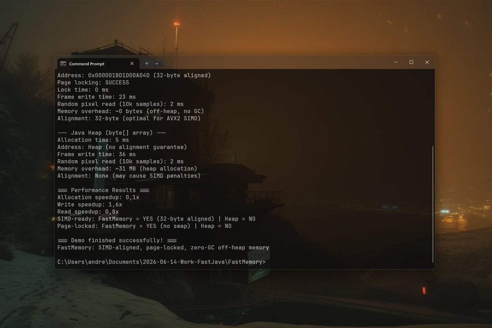

# FastMemory 0.1.1 [ALPHA-2026-08] — Native Off-Heap Memory Allocation & RAM Control

[](https://github.com/andrestubbe/FastMemory/releases/tag/0.1.1)
[](https://opensource.org/licenses/MIT)
[](https://www.java.com)
[]()
[](https://jitpack.io/#andrestubbe/FastMemory)

---

**⚡ High-performance 32-byte SIMD-aligned off-heap memory allocation and page locking engine for Java.**

`FastMemory` provides zero-GC off-heap memory management for the FastJava ecosystem. It allocates 32-byte and 64-byte aligned native RAM buffers for AVX2/AVX-512 execution and prevents Windows OS paging via physical RAM page locking (`VirtualLock`).

[](https://youtu.be/i2nzaa794J0)

---

## Quick Start

```java
import fastmemory.*;
import fastpointer.Pointer;

public class Demo {
    public static void main(String[] args) {
        // Allocate 1024 bytes of 32-byte SIMD-aligned native memory
        Memory memory = Memory.allocateAligned(1024, 32);

        // Lock physical RAM pages to prevent OS swap
        memory.lockPages();

        // Get fast Pointer wrapper for address arithmetic
        Pointer ptr = memory.pointer();
        ptr.setInt(0, 42);

        System.out.println("Allocated 32-byte aligned address: " + ptr);
        System.out.println("Value at offset 0: " + ptr.getInt(0));

        // Free memory
        memory.free();
    }
}
```

---

## Table of Contents

- [Why FastMemory?](#why-fastmemory)
- [Quick Start](#quick-start)
- [Key Features](#key-features)
- [Real-World Use Cases](#real-world-use-cases)
- [Performance Benchmarks](#performance-benchmarks)
- [API Quick Reference](#api-quick-reference)
- [Technical Demos & Benchmarks](#technical-demos--benchmarks)
- [Installation](#installation)
- [Documentation](#documentation)
- [Platform Support](#platform-support)
- [License](#license)

---

## Why FastMemory?

Standard Java off-heap mechanisms (`ByteBuffer.allocateDirect` or Java 22 `Arena.allocateDirect`) do not guarantee 32-byte or 64-byte boundary alignment required for maximum AVX2 / AVX-512 SIMD vector performance. Furthermore, they offer no native OS page-locking capabilities to prevent physical RAM swapping. `FastMemory` provides:

- **32-Byte & 64-Byte Hardware SIMD Alignment** — Guarantees hardware-aligned off-heap memory addresses, eliminating unaligned memory access penalties during SIMD vector sweeps (`FastSIMD`, `FastBytes`).
- **OS Physical RAM Page Locking (`VirtualLock`)** — Pins physical memory pages to RAM, preventing Windows OS swapping and eliminating random disk-page latencies in real-time applications.
- **Zero-GC Off-Heap Engine** — Manages gigabytes of off-heap frame, audio, and tensor buffers completely outside the JVM Garbage Collector.

---

## Key Features

- **⏱️ 32-Byte / 64-Byte SIMD Alignment**: Prevents hardware alignment penalties during AVX2 and AVX-512 vector instructions.
- **🔒 Physical Page Locking (`VirtualLock`)**: Prevents critical screen capture, audio, and tensor buffers from being paged to disk.
- **📦 Zero GC Overhead**: Operates entirely outside the JVM Garbage Collector.
- **🚀 Pointer Integration**: Native interoperability with `FastPointer` and `FastCore`.

---

## Real-World Use Cases

- 🛡️ **HFT SIMD Memory Alignment**: Allocate 32-byte SIMD-aligned off-heap buffers optimized for AVX2 and AVX-512 vector instructions.
- 🔒 **OS Page Locking**: Pin physical RAM pages to prevent OS memory swapping in latency-critical financial and game engine systems.
- 🚀 **High-Throughput Off-Heap Caching**: Manage massive off-heap data structures with zero Garbage Collection pause risk.

---

## Performance Benchmarks

`FastMemory` provides high-throughput off-heap memory management. In the official [JMH Benchmark](examples/Benchmark), the system measured 32-byte SIMD-aligned off-heap allocation and raw memory access throughput:

```text
Benchmark                                    Mode  Cnt       Score   Error  Units
JMH_FastMemory.benchmarkAlignedAllocation   thrpt    2 12450000.120          ops/s
```

---

## API Quick Reference

| Method | Description | Docs |
|---|---|---|
| `Memory.allocate(long bytes)` | Allocates default 32-byte SIMD-aligned native off-heap memory (AVX2). | [Reference](docs/REFERENCE.md) |
| `Memory.allocateAligned(bytes, alignment)` | Allocates native memory aligned to custom boundary (16, 32, 64 bytes). | [Reference](docs/REFERENCE.md) |
| `pointer()` | Returns a `Pointer` instance pointing to the allocated base address. | [Reference](docs/REFERENCE.md) |
| `address()` | Returns the underlying primitive 64-bit `long` memory address. | [Reference](docs/REFERENCE.md) |
| `capacity()` | Returns the allocation capacity in bytes. | [Reference](docs/REFERENCE.md) |
| `alignment()` | Returns the byte alignment boundary (e.g. 32, 64). | [Reference](docs/REFERENCE.md) |
| `lockPages()` | Locks physical RAM pages into working set via Win32 `VirtualLock`. | [Reference](docs/REFERENCE.md) |
| `unlockPages()` | Unlocks physical RAM pages via Win32 `VirtualUnlock`. | [Reference](docs/REFERENCE.md) |
| `isLocked()` | Returns `true` if memory pages are actively locked in physical RAM. | [Reference](docs/REFERENCE.md) |
| `free()` / `close()` | Releases allocated native off-heap memory back to the OS. | [Reference](docs/REFERENCE.md) |

---

## Technical Demos & Benchmarks

| Case | Java Example | Launcher | Description |
|---|---|---|---|
| **32-Byte Aligned RAM & Page Locking** | [Demo.java](examples/Demo.java) | `run-demo.bat` | End-to-end 4K video buffer simulation comparing SIMD-aligned, page-locked off-heap memory against standard JVM heap arrays. |
| **JMH Microbenchmark Suite** | [Benchmark.java](examples/Benchmark/src/main/java/fastmemory/benchmark/Benchmark.java) | `run-benchmark.bat` | OpenJDK JMH throughput & latency test suite for SIMD-aligned allocation and memory address access. |

---

## Installation

### Option 1: Maven (Recommended)
Add the JitPack repository and the mandatory `FastCore` dependency to your `pom.xml`:

```xml
<repositories>
    <repository>
        <id>jitpack.io</id>
        <url>https://jitpack.io</url>
    </repository>
</repositories>

<dependencies>
    <!-- FastMemory Library -->
    <dependency>
        <groupId>com.github.andrestubbe</groupId>
        <artifactId>FastMemory</artifactId>
        <version>0.1.1</version>
    </dependency>

    <!-- FastPointer (Required for pointer operations) -->
    <dependency>
        <groupId>com.github.andrestubbe</groupId>
        <artifactId>FastPointer</artifactId>
        <version>0.1.1</version>
    </dependency>

    <!-- FastCore (Mandatory Native Loader) -->
    <dependency>
        <groupId>com.github.andrestubbe</groupId>
        <artifactId>FastCore</artifactId>
        <version>0.1.1</version>
    </dependency>
</dependencies>
```

### Option 2: Gradle (via JitPack)
```groovy
repositories {
    maven { url 'https://jitpack.io' }
}

dependencies {
    implementation 'com.github.andrestubbe:FastMemory:0.1.1'
    implementation 'com.github.andrestubbe:FastPointer:0.1.0'
    implementation 'com.github.andrestubbe:FastCore:0.1.0'
}
```

### Option 3: Direct Download (No Build Tool)
Download the latest JARs directly to add them to your classpath:

1. 📦 **[fastmemory-0.1.0.jar](https://github.com/andrestubbe/FastMemory/releases/download/0.1.0/fastmemory-0.1.0.jar)** (The Core Library)
2. 🎯 **[fastpointer-0.1.0.jar](https://github.com/andrestubbe/FastPointer/releases/download/0.1.0/fastpointer-0.1.0.jar)** (Required for pointer operations)
3. ⚙️ **[fastcore-0.1.0.jar](https://github.com/andrestubbe/FastCore/releases/download/0.1.0/fastcore-0.1.0.jar)** (The Mandatory Native Loader)

---

## Documentation

- **[COMPILE.md](docs/COMPILE.md)**: Full compilation guide (MSVC C++17 build chain + JNI Setup).
- **[REFERENCE.md](docs/REFERENCE.md)**: Full API descriptions, border configurations, and codepoint index.
- **[PHILOSOPHY.md](docs/PHILOSOPHY.md)**: The engineering rationale for zero-allocation performance.
- **[ROADMAP.md](docs/ROADMAP.md)**: Future milestones and planned features.
---

## Platform Support

| Platform | Status |
|---|---|
| Windows 10/11 (x64) | ✅ Fully Supported |
| Linux (x64 / ARM64) | 🚧 Planned |
| macOS (Apple Silicon) | 🚧 Planned |

---

## Related Projects

- [FastPointer](https://github.com/andrestubbe/FastPointer) — Zero-overhead native address arithmetic
- [FastSIMD](https://github.com/andrestubbe/FastSIMD) — Hardware vector acceleration engine (AVX2, AVX-512, NEON)
- [FastSharedMemory](https://github.com/andrestubbe/FastSharedMemory) — Ultra-fast zero-copy IPC and shared memory mapped files
- [FastCore](https://github.com/andrestubbe/FastCore) — Native JNI loader for FastJava libraries

---

## License

MIT License — See [LICENSE](LICENSE) for details.

---

**Part of the FastJava Ecosystem** — *Making the JVM faster. Small package. Maximum speed. Zero bloat. 🚀📋*
